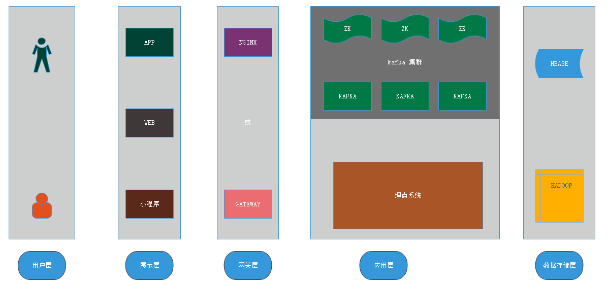
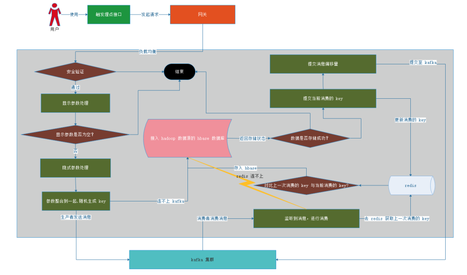
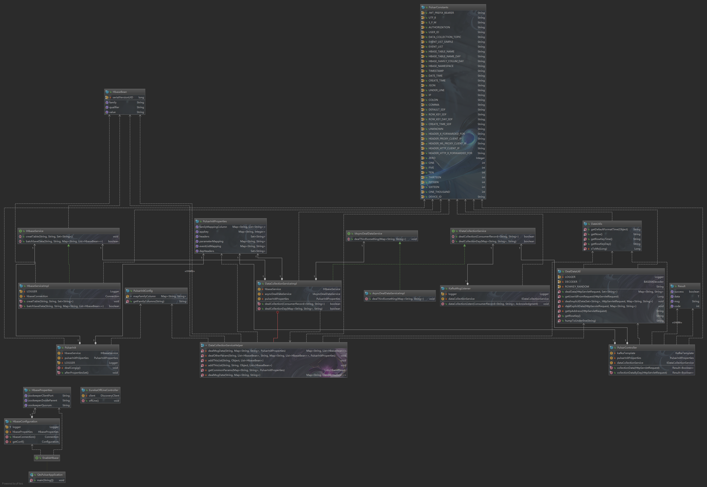
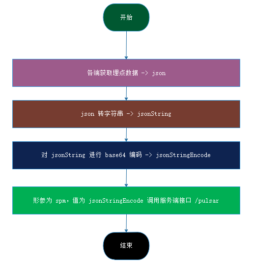
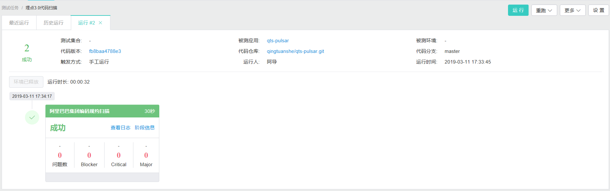

# 背景

万事皆有因，之所以会衍生出 3.0 版本，主要是遇到以下2个瓶颈

- 流量快速的发展，原有的系统 ＩＯ处理慢慢跟不上现有的公司业务发展
- 埋点数据量的快速递增，普通的关系型数据库对于数据写入和读取都存在极大的效率问题

为了解决以2个问题，首先使用　kafka 进行削峰填谷，当然我们也可以再添加一层缓存堵住高并发的情况，不过项目的演进需要遵循演化原则，切勿操作过急，然后使用 hbase 作为数据库，进行海量存储，解决数据存储问题。

# 架构设计

系统的技术架构图如下所示，用户通过使用我们的工程，触发打点事件，并向我们服务器发送埋点请求，经过网关进行负载均衡进入埋点系统，在埋点系统中进行一些处理后通过 kafka 进行削峰填谷，然后消费者进行消费将数据存入以 hadoop 为数据源的 hbase 数据库。



[埋点架构 PPT](./datacollection-record/埋点架构.pptx)

# 后端处理流程

这幅图是我开始设计的，后来考虑到 kafka 的稳定性，一些流程可以做一些删减，简化处理逻辑，如通过 redis 原子性操作做幂等处理，下面我来解释一下我们这边处理的逻辑，首先用户触发埋点接口，通过网关的负载均衡处理到具体的埋点系统，然后通过我们安全认证（如 json web token）,然后处理参数，通过 kafka 发送埋点消息，处理当下高并发的情况，然后消费成功，提交偏移量，通知 kafka 消费成功。




以下是后端设计的 UML 图，具体流程可以查看[源文件](./datacollection-record/img/wwjd-data-collection.uml)




# 后端自定义配置说明

### hbase 配置

```properties

wwjd.hbase.zookeeper-quorum=127.0.0.1
wwjd.hbase.zookeeper-client-port=2194
wwjd.hbase.zookeeper-znode-parent=/hbase

```

### header 头信息获取

```properties

# 常规埋点数据
wwjd.data-collection.cofig.headers=referer
# 每日打开数据源方获取头部信息
wwjd.data-collection.cofig.day-headers=ip

```

### 支持简写形参设置

```properties


# parameter 映射
wwjd.data-collection.cofig.parameter-mapping.ve=vest
wwjd.data-collection.cofig.parameter-mapping.a=appkey
wwjd.data-collection.cofig.parameter-mapping.c=channel
wwjd.data-collection.cofig.parameter-mapping.d=device_id
wwjd.data-collection.cofig.parameter-mapping.t=town_id
wwjd.data-collection.cofig.parameter-mapping.lo=lon
wwjd.data-collection.cofig.parameter-mapping.la=lat
wwjd.data-collection.cofig.parameter-mapping.o=os_version
wwjd.data-collection.cofig.parameter-mapping.v=version
wwjd.data-collection.cofig.parameter-mapping.s=session_id
wwjd.data-collection.cofig.parameter-mapping.e=event_list
# --eventList
wwjd.data-collection.cofig.event-list-mapping.p=position_id
wwjd.data-collection.cofig.event-list-mapping.c=content_id
wwjd.data-collection.cofig.event-list-mapping.e=event_type
wwjd.data-collection.cofig.event-list-mapping.ri=refer_id
wwjd.data-collection.cofig.event-list-mapping.ci=current_id
wwjd.data-collection.cofig.event-list-mapping.bt=business_type
wwjd.data-collection.cofig.event-list-mapping.bi=business_id
wwjd.data-collection.cofig.event-list-mapping.d=duration
wwjd.data-collection.cofig.event-list-mapping.t=timestamp
wwjd.data-collection.cofig.event-list-mapping.r=renark

```


### 落库白名单配置

```properties

# 常规埋点数据
wwjd.data-collection.cofig.data-collection-white-qualifier=session_id,device_id,town_id,position_id,content_id,refer_id,current_id,event_type,business_type,business_id,duration,timestamp,remark,refer,json,create_time
# 每日打开埋点源方发起的埋点数据
wwjd.data-collection.cofig.data-collection-day-white-qualifier=lon,lat,ip,device_id,os_version,version,vest,appkey,channel


```

### 落库列族和列对应关系配置

```properties

# 目前只支持常规埋点（看后期取数做调整），每日一次的没必要分列族
wwjd.data-collection.cofig.family_mapping_column.f1=session_id,device_id,town_id,position_id,content_id,refer_id,current_id,event_type,business_type,business_id,duration,timestamp,remark,refer,json,create_time
wwjd.data-collection.cofig.family_mapping_column.f2=

```


# 埋点数据源方和后端交互

### 每日打开埋点源方发起埋点数据

- `请求方式`：目前支持所有的请求方式
- `请求 URI`：contentpath+**/data-collection/day**
- `参数列举`

|字段|支持的缩写|字段说明|
|:---|:---|:---|
|lon|lo|经度|
|lat|la|纬度|
|deviceId|d|设备 ID|
|osVersion|o|系统版本号|
|version|v|版本号|
|vest|ve|马甲包，IOS 拥有|
|appkey|a|应用来源|
|channel|c|渠道包，市场|
|address|ad|地理位置|

- appkey 后期可能会去去掉，使用 deviceId 前缀区分，（deviceId 规则约束如下）如下：

|code|老版本 code|中文释义|
|:---|:---|:---|
|0|未知|未知|
|1|wwjdHE_IOS_USER|IOS 学生端|
|2|wwjdHE_ANDROID_USER|安卓学生端|
|3|wwjdHE_IOS_COMPANY|IOS 商家端|
|4|wwjdHE_ANDROID_COMPANY|安卓商家端|
|5|wwjdHE_MINI_APP|微信小程序|
|6|wwjdHE_ZFB_MINI_APP|支付宝小程序|


### 常规埋点数据

- `请求方式`：目前支持所有的请求方式
- `请求 URI`：contentpath+**/data-collection**
- `参数列举`

|字段|支持的缩写|字段说明|
|:---|:---|:---|
|sessionId|s|会话标志|
|deviceId|d|设备 ID|
|townId|t|城市 ID|
|eventList|e|json 数据|

- json 数据

|字段|支持的缩写|字段说明|
|:---|:---|:---|
|positionId|p|资源位 ID|
|contentId|c|内容 ID|
|referId|ri|入口（来源）页面|
|currentId|ci|当前的页面|
|eventType|e|事件类型，枚举{1：曝光:2：点击:3：程序唤醒:4：程序挂起,5.页面打开，6.页面关闭，7.10秒心跳事件}|
|businessType|bt|业务类型——1：兼职 ，2：小任务 ，3：实习，4：以少胜多|
|businessId|bi|业务 ID|
|duration|d|时长|
|timestamp|t|时间戳|
|remark |r|扩展信息|


### 后端自行处理的参数

|字段|字段说明|
|:---|:---|
|refer | 通过 HEADER 获取来源页面|
|ip |通过 HEADER 获取 IP 地址|
|json  |存储整个 eventList json 串|
|create_time |落库时间。理论这个不需要，为了方便设计|


### 传输统一说明

所有参数首先将 json 转字符串，然后通过 base64 处理作为传输参数,形参名为 spm,具体流程示意如下：




另外经协商，字段名称进行精简（支持不精简，我已做兼容），映射关系如下（Authorization 放 header 里面，也就是 JWT（json web token）信息）


# 后端存入 hbase 与大数据端字段约定

### 每日打开埋点源方发起埋点数据

- `namespace`:wwjd

- `tablename`:data_collection_day

- `内容说明`

|列族|列名|字段说明|
|:---|:---|:---|
|f1|lon|经度|
|f1|lat|纬度|
|f1|ip|网络地址|
|f1|device_id|设备 ID|
|f1|os_version|系统版本号|
|f1|version|版本号|
|f1|vest|马甲包，IOS 拥有|
|f1|appkey|应用来源|
|f1|channel|渠道包，市场|
|f1|address|地理位置|

### 常规埋点数据

- `namespace`:wwjd

- `tablename`:data_collection

- `内容说明`

|列族|列名|字段说明|
|:---|:---|:---|
|f1|session_id|会话标志|
|f1|device_id|设备 ID|
|f1|town_id|城市 ID|
|f1|position_id|资源位 ID|
|f1|content_id|内容 ID|
|f1|refer_id|入口（来源）页面|
|f1|current_id|当前的页面|
|f1|event_type|事件类型，枚举{1：曝光:2：点击:3：程序唤醒:4：程序挂起,5.页面打开，6.页面关闭，7.10秒心跳事件}|
|f1|business_type|业务类型——1：兼职 ，2：小任务 ，3：实习，4：以少胜多|
|f1|business_id|业务 ID|
|f1|duration|时长|
|f1|timestamp|时间戳|
|f1|date_time |时间戳转换|
|f1|remark |扩展信息|
|f1|refer | 通过 HEADER 获取来源页面|
|f1|json  |存储整个 eventList json 串|
|f1|create_time |落库时间。理论这个不需要，为了方便设计|


# 开发建议

- 大家在开发的过程中尽可能遵循六大原则

- 尽可能的写一些注释，方便代码后期维护

- 每次版本迭代的变更最好都记录下来

- 每次写完代码尽可能的用阿里巴巴编约规范扫一下，尽可能的养成良好的编码习惯

# 代码质量检查结果报告（PS : 在公司内部项目名称是 qts-pulsar）



# 结束语

感谢大家的认真浏览，不足之处请多多指教。
