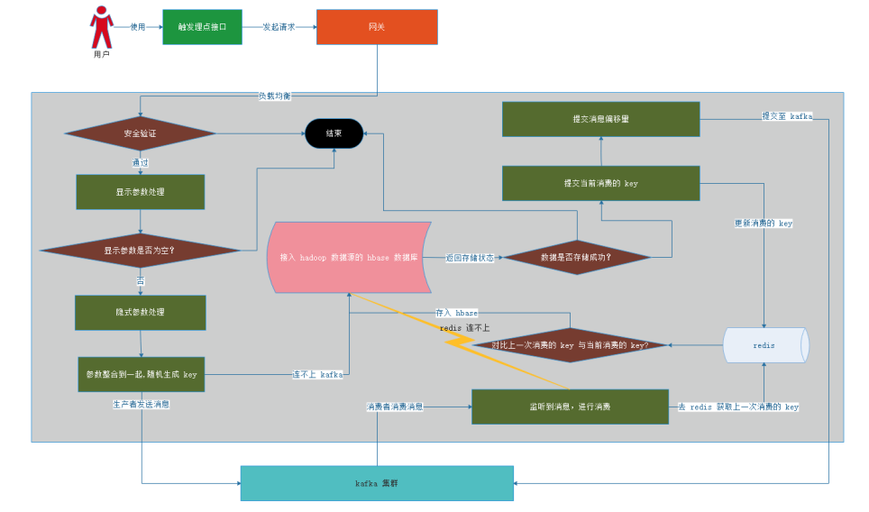

## 背景

万事皆有因，之所以会衍生出 3.0 版本，主要是遇到以下2个瓶颈

- 流量快速的发展，原有的系统 ＩＯ处理慢慢跟不上现有的公司业务发展
- 埋点数据量的快速递增，普通的关系型数据库对于数据写入和读取都存在极大的效率问题

为了解决以2个问题，首先使用　kafka 进行削峰填谷，当然我们也可以再添加一层缓存堵住高并发的情况，不过项目的演进需要遵循演化原则，切勿操作过急，然后使用 hbase 作为数据库，进行海量存储，解决数据存储问题。

## 架构设计

系统的技术架构图如下所示，用户通过使用我们的工程，触发打点事件，并向我们服务器发送埋点请求，经过网关进行负载均衡进入埋点系统，在埋点系统中进行一些处理后通过 kafka 进行削峰填谷，然后消费者进行消费将数据存入以 hadoop 为数据源的 hbase 数据库。


## 后端处理流程

这幅图是我开始设计的，后来考虑到 kafka 的稳定性，一些流程可以做一些删减，简化处理逻辑，如通过 redis 原子性操作做幂等处理，下面我来解释一下我们这边处理的逻辑，首先用户触发埋点接口，通过网关的负载均衡处理到具体的埋点系统，然后通过我们安全认证（如 json web token）,然后处理参数，通过 kafka 发送埋点消息，处理当下高并发的情况，然后消费成功，提交偏移量，通知 kafka 消费成功。



## 字段交互约定

- 数据源和后端的数据约定【用 base64 处理一下作为内容，然后参数名使用 spm，剩下就交给后端捣鼓】

```json

   个性化字段，数据来源方包裹成 json 串并转 string 类型，形参：eventList
  
   经协商，字段名称进行精简，映射关系如下（Authorization 放 header 里面，也就是 JWT（json web token）信息）：
    | ve->vest 【马甲包，IOS 拥有，建议去掉，无统计意义】
    | a->appkey 【应用来源，】
    | c->channel 【渠道包，市场】
    | d->deviceId 【设备 ID】
    | t->townId 【城市 ID】
    | lo->lon 【经度】
    | la->lat 【纬度】
    | o->osVersion 【系统版本号】
    | v->version 【版本号】
    | s->sessionId 【会话标志】
    | e->eventList 【json 形参】
-------------------------------------------------------------
    | p->positionId 【资源位 ID】
    | c->contentId 【内容 ID】
    | e->eventType 【事件类型，枚举{1：曝光:2：点击:3：程序唤醒:4：程序挂起,5.页面打开，6.页面关闭，7.10秒心跳事件}】**
    | ri->referId 【入口（来源）页面】
    | ci->currentId 【当前的页面】
    | bt->businessType 【业务类型——1：兼职 ，2：小任务 ，3：实习，4：以少胜多】
    | bi->businessId  【业务 ID】
    | d->duration 【时长】
    | t->timestamp 【时间戳】
    | r->renark 【扩展信息，建议去掉】


-----------------------------------------------------------------


{    

    "ve":"【马甲包，IOS 拥有】",
    "a":"【应用来源】",
    "c":"【渠道包，市场】",
    "d":"【设备 ID】",
    "t":"【城市 ID】",
    "lo":"【经度】",
    "la":"【纬度】",
    "o":" 【系统版本号】",
    "v":"【版本号】",
    "s":" 【会话标志】",
    "e":[
        {
            "p":" 【资源位 ID】",
            "c":" 【内容 ID】",
            "e":" 【事件类型，枚举{1：曝光:2：点击:3：程序唤醒:4：程序挂起,5.页面打开，6.页面关闭，7.10秒心跳事件}】",
            "ri":" 【入口（来源）页面】",
            "ci":" 【当前的页面】",
            "bt ":" 【业务类型——1：兼职 ，2：小任务 ，3：实习，4：以少胜多】",
            "bi":" 【业务 ID】",
            "d ":" 【时长】",
            "t ":" 【时间戳】",
            "r":" 【扩展信息】"
        },{
            "p":" 【资源位 ID】",
            "c":" 【内容 ID】",
            "e":" 【事件类型，枚举{1：曝光:2：点击:3：程序唤醒:4：程序挂起,5.页面打开，6.页面关闭，7.10秒心跳事件}】",
            "ri":" 【入口（来源）页面】",
            "ci":" 【当前的页面】",
            "bt ":" 【业务类型——1：兼职 ，2：小任务 ，3：实习，4：以少胜多】",
            "bi":" 【业务 ID】",
            "d ":" 【时长】",
            "t ":" 【时间戳】",
            "r":" 【扩展信息】"   
        }      
    ]
}


```

- 后端存入 hbase 与大数据端字段约定

```properties

	

    · f_business

	| refer_id 【入口（来源）页面】
	| refer 【来源页面，后端获取】
	| current_id 【当前的页面】
	| session_id 【会话标志】
	| position_id 【资源位 ID】
	| content_id 【内容 ID】
	| event_type 【事件类型，枚举{1：曝光:2：点击:3：程序唤醒:4：程序挂起,5.页面打开，6.页面关闭，7.10秒心跳事件}】
	| business_type 【业务类型——1：兼职 ，2：小任务 ，3：实习，4：以少胜多】
	| business_id 【业务 ID】


    · f_location

	| town_id 【城市 ID】
	| lon 【经度】
	| lat 【纬度】
	| ip 【IP】


    · f_user

	| user_id 【用户 ID】
	| device_id 【设备 ID】
	| os_version 【系统版本号】
	| version 【版本号】
	| vest 【马甲包，IOS 拥有】
	| appkey 【应用来源】
	| channel 【渠道包，市场】

    · f_other

	| duration 【时长】
	| timestamp 【时间戳】
	| remark 【扩展信息】
	| date_time 【对时间戳格式化成年月日】
	| json 【存储来源的 json 串单体】
	| create_time

    · f_expand

```

## 结束语

感谢大家的认真浏览，不足之处请多多指教。
